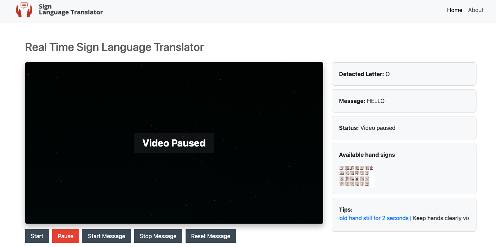

# Real-Time Sign Language Translator
<!-- add an image here form static folder static/images/real_time_sign_language_translator_sample1.jpg -->


**For Learning & Training Purposes Only**

Welcome to the Real-Time Sign Language Translator project! This application bridges the communication gap between individuals using sign language and those unfamiliar with it. The translator uses advanced machine learning and computer vision techniques to recognise hand gestures in real time and convert them into readable text.

[AVailable sign languages](static/images/real_time_sign_language_translator_sample1.jpg)

## Table of Contents

- [Introduction](#introduction)
- [Features](#features)
- [Technology Stack](#technology-stack)
- [Installation](#installation)
- [Usage](#usage)
- [Results and Achievements](#results-and-achievements)
- [Challenges Faced](#challenges-faced)
- [Future Work](#future-work)
- [References](#references)
- [Conclusion](#conclusion)

## Introduction

Sign language is a crucial communication medium for the deaf and hard-of-hearing communities. However, many people are unfamiliar with it, creating a barrier to effective communication. This project focuses on creating an accessible and practical solution by translating sign language into text in real time, using machine learning models and video feed processing.

## Features

- **Real-Time Gesture Recognition**: Detects and interprets hand gestures dynamically from live video input.
- **Gesture-to-Text Translation**: Converts detected gestures into corresponding letters and displays them on-screen.
- **Message Compilation**: Concatenates detected letters to words.
- **User-Friendly Interface**: Simple and interactive interface with buttons to start, pause, start message, stop message and reset message.
- **Cross-Platform Compatibility**: Works on various devices with a modern web browser and webcam support.

## Technology Stack

### Front-End Technologies
- **HTML/CSS**: Structure and styling of the web application.
- **JavaScript**: Handles dynamic interactions and real-time updates.
- **Bootstrap**: Ensures responsiveness and a modern interface design.

### Back-End Technologies
- **Django**: Backend framework for managing server logic and handling requests.
- **TensorFlow**: Powers the machine learning model for gesture recognition.
- **OpenCV**: Captures and processes real-time video feed for gesture detection.

### Additional Libraries
- **MediaPipe**: Handles hand gesture detection and tracking.
- **NumPy**: Supports numerical computations and array handling.
- **Pandas**: Organises and pre-processes data efficiently.
- **Matplotlib**: Provides data visualisation during training.
- **Seaborn**: Creates detailed statistical visualisations.
- **Scikit-Learn**: Assists with data pre-processing and model optimisation.
- **Pickle**: Saves and loads the trained model for efficient reuse.

## Installation

### Important Note
PLEASE NOTE THAT YOU MIGHT GET AN ERROR WHILE CAPTURING THE VIDEO AND YOU MIGHT NEED TO CHANGE INDEX NUMBER FROM 1 TO 0 AS MY PC WAS INDEXED AT 1. FOLLOWING ARE THE FILES WITH LINE NUMBER

| File               | Line Number | Code                                       |
|--------------------|-------------|--------------------------------------------|
| `collect_images.py` | 21          | `camera = cv2.VideoCapture(1)`             |
| `views.py`          | 84          | `video_capture = cv2.VideoCapture(1)`      |


### Prerequisites

- Python 3.9 or higher
- pip (Python package installer)
- Virtual environment (optional but recommended)

### Steps

1. **Clone the repository**:
    ```bash
    git clone https://github.com/shahid129/rtslt.git
    cd rtslt
    ```

2. **Create and activate a virtual environment**:
    ```bash
    python -m venv venv
    source venv/bin/activate  # For windows  `venv\Scripts\activate`
    ```

3. **Install the required dependencies**:
    ```bash
    pip install -r requirements.txt
    ```

4. **Run database migrations**:
    ```bash
    python manage.py migrate
    ```

5. **Start the Django development server**:
    ```bash
    python manage.py runserver
    ```

## Usage

1. **Access the application**:
    - Open your web browser and navigate to `http://127.0.0.1:8000`
    - Grant the application access to your webcam
    - Use the provided controls to start the video feed and detect hand gestures
    - View the recognised gestures and constructed message on the interface

The next steps are only if you want to create your own dataset

2. **Collect Images**:
    Use and run the `collect_images.py` script to capture images for different hand sign classes.

3. **Create Dataset**:
    Use and run the `create_dataset.py` script to to create data and save it.

4. **Train the Model**:
    Use and run the `train_hand_sign.py` script to train the Random Forest classifier.

## Results and Achievements
The project delivered a real-time sign language translator, converting hand gestures into text with over 100% accuracy using MediaPipe and TensorFlow. This milestone demonstrated the power of combining computer vision and machine learning. The integration of Django ensured a robust backend, while the user-friendly front-end made it accessible to all, showcasing the practical potential of such technologies for inclusive communication

## Challenges Faced
Despite its success, the project encountered several challenges during development. One major issue was the limitation of the initial dataset. The Sign Language MNIST dataset, designed for static gesture recognition, did not perform well when applied to real-time applications. This led to the decision to create and train a custom dataset using live video feeds, which required additional effort but ultimately improved the system’s accuracy. Environmental factors like lighting and background variations affected detection accuracy, making consistent performance challenging.

## Future Work
Expand language support to include multiple sign languages, develop a mobile app for increased accessibility, and integrate voice output for translated text. Additionally, explore the potential for integrating the prototype with wearable devices, such as Google Glass, to provide a more seamless, hands-free translation experience.

## References

- [TensorFlow documentation](https://www.tensorflow.org/)
- [Django documentation](https://docs.djangoproject.com/)
- [OpenCV documentation](https://docs.opencv.org/)
- [MediaPipe documentation](https://mediapipe.dev/)
- [NumPy documentation](https://numpy.org/doc/)
- [Pandas documentation](https://pandas.pydata.org/docs/)
- [Matplotlib documentation](https://matplotlib.org/stable/contents.html)
- [Seaborn documentation](https://seaborn.pydata.org/)
- [Scikit-Learn documentation](https://scikit-learn.org/stable/)
- [Pickle Module documentation](https://docs.python.org/3/library/pickle.html)
- [Bootstrap documentation](https://getbootstrap.com/docs/)
- [jQuery documentation](https://api.jquery.com/)
- [Pytest documentation](https://docs.pytest.org/en/stable/)
- [Workflow diagram](https://app.diagrams.net/)
- [Python testing](https://pep8ci.herokuapp.com/)
- [JavaScript testing](https://jshint.com/)
- [HTML testing](https://validator.w3.org/nu/)
- [CSS testing](https://jigsaw.w3.org/css-validator/)
- [Wireframe](https://wireframe.cc/)
- [Color palette](https://coolors.co/)


### A lot of help was taken from the following sources as well
- [Stack Overflow](https://stackoverflow.com/)
- [GeeksforGeeks](https://www.geeksforgeeks.org/)
- [Medium](https://medium.com/tag/machine-learning)
- [Nurture](https://www.nature.com/articles/s41598-023-43852-x)
- [Youtube](https://www.youtube.com/)

## Conclusion
Although the initial attempt using the Sign Language MNIST dataset did not yield desirable results due to its static image limitation, creating and training a custom dataset using live webcam feeds resolved this issue. This realisation underlines the importance of context-specific datasets for successful implementation. This project sets a foundation for further advancements, showcasing the potential to create accessible and inclusive communication tools.